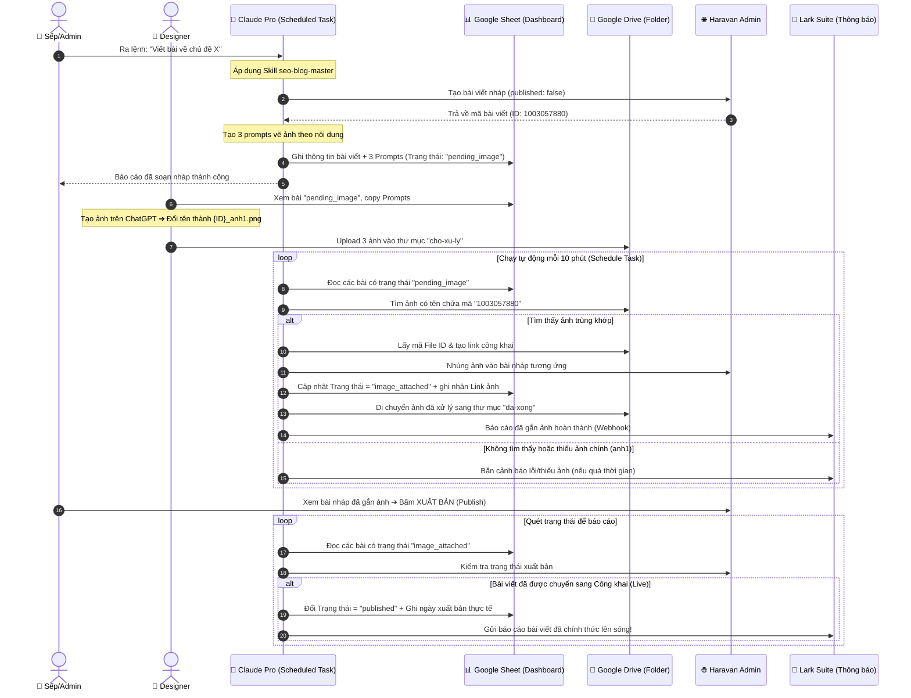

# HƯỚNG DẪN CHI TIẾT QUY TRÌNH TỰ ĐỘNG HÓA BLOG 
## (Haravan + Google Drive + Google Sheets + Claude Pro Scheduled Run)

Tài liệu này giải thích chi tiết luồng vận hành tự động hóa khâu viết bài, thiết kế ảnh và xuất bản bài blog dành cho **AIZEN**. Quy trình này được xây dựng theo mô hình **bán tự động (Semi-automation)**: Máy làm các khâu lặp lại nặng nhọc, con người chỉ thực hiện khâu sáng tạo (vẽ ảnh bằng AI) và kiểm duyệt chất lượng trước khi đăng.

---

## 📌 TÓM TẮT DÀNH CHO SẾP (Đọc trong 30 giây)

* **Sếp/Admin chỉ làm 2 việc:**
  1. Vào file Google Sheet để xem các bài viết mới và lấy prompt vẽ ảnh.
  2. Vào trang Haravan Admin kiểm tra bài viết nháp đã được tự động gắn sẵn ảnh và bấm **Xuất bản (Publish)**.
* **Mọi khâu trung gian còn lại:** Được chạy tự động hoàn toàn bởi **Claude Pro chạy nền theo lịch trình (Scheduled Task)** kết hợp với Google Sheets và Google Drive.

---

## 📊 SƠ ĐỒ LUỒNG VẬN HÀNH CHI TIẾT (100% TỰ ĐỘNG CHẠY NỀN)

Sơ đồ dưới đây mô tả cách hệ thống tự động giao tiếp và đồng bộ dữ liệu sau khi được cấu hình lịch chạy tự động:

---

## 👥 CHI TIẾT TỪNG VAI TRÒ TRONG QUY TRÌNH

### 1. 🤖 ĐỐI VỚI CLAUDE PRO (Tác nhân chạy ngầm tự động)
* **Khởi tạo (Chạy ngầm):** Claude chạy theo lịch trình lặp lại (ví dụ mỗi 10 phút).
* **Quét dữ liệu:** Claude tự động đọc Google Sheet ➔ Lọc ra các dòng bài viết có cột Status là `pending_image`.
* **Quét Google Drive:** Dùng API tìm kiếm trực tiếp trong folder `cho-xu-ly` các file chứa mã số ID của bài viết (Ví dụ: `1003057880_anh`).
* **Xử lý logic:**
  1. Tự chuyển đổi File ID của ảnh trên Drive thành link ảnh công khai có dạng direct download: `https://drive.google.com/uc?id={fileId}&export=download`.
  2. Gọi API cập nhật bài viết Haravan: Thiết lập `anh1` làm ảnh đại diện chính (featured image) và nhúng `anh2`, `anh3` vào thân bài.
  3. Di chuyển ảnh trên Drive sang folder `da-xong` để dọn dẹp bộ nhớ.
  4. Cập nhật dòng tương ứng trên Google Sheet: Đổi Status thành `image_attached` (Đã gắn ảnh).
  5. Gọi Lark Webhook để gửi tin nhắn báo cáo cho nhóm làm việc.

---

### 2. 🎨 ĐỐI VỚI DESIGNER (Thiết kế ảnh)
* **Nhận nhiệm vụ:** Designer chỉ cần mở file Google Sheet chung ra xem.
* **Lấy yêu cầu:** Cột `Image Prompt 1, 2, 3` trên Sheet đã hiển thị đầy đủ và rộng rãi câu lệnh vẽ ảnh chi tiết bằng tiếng Anh (được thiết kế tối ưu rộng 380px, tự động xuống dòng không bao giờ bị che khuất).
* **Thiết kế & Tải lên:**
  1. Copy prompt ➔ Dán vào ChatGPT hoặc các công cụ vẽ ảnh AI khác.
  2. Tải ảnh về ➔ Đổi tên file theo đúng mã ID cột đầu tiên của hàng đó:
     * Ảnh bìa: `{ID}_anh1.png` ➔ Ví dụ: `1003057880_anh1.png`
     * Ảnh phụ trong bài: `{ID}_anh2.png`, `{ID}_anh3.png`
  3. Upload toàn bộ ảnh vào thư mục **`BlogAuto/cho-xu-ly`** trên Google Drive. 
  *(Quyền chia sẻ công khai của thư mục con này tự động thừa kế từ thư mục cha `BlogAuto` nên Designer không cần bấm nút Share thủ công từng ảnh nữa).*

---

### 3. 👑 ĐỐI VỚI QUẢN LÝ (Sếp/Admin duyệt bài)
* **Duyệt chất lượng:** Khi nhận được tin nhắn trên Lark báo bài viết đã được gắn ảnh hoàn tất.
* **Thực thi:** Sếp vào trang quản trị Haravan Admin ➔ Vào mục Bài viết nháp ➔ Xem lại bố cục, câu từ và ảnh minh họa ➔ Bấm nút **Xuất bản (Publish)** để đưa bài viết lên website thật.
* **Hệ thống tự động ghi nhận:** Claude chạy ngầm sẽ tự động nhận biết bài viết đã được xuất bản trên Haravan, tự động đổi trạng thái dòng đó trên Google Sheet từ `image_attached` thành `published` và ghi nhận ngày giờ đăng bài thực tế để làm báo cáo hiệu suất SEO.

---

## 💡 CÁC ĐIỂM CẢI TIẾN CỰC KỲ THÂN THIỆN VỚI NGƯỜI "KHÔNG CHUYÊN"

1. **Giao diện Google Sheet tối ưu trực quan:**
   * Các cột chữ dài (như Prompt vẽ ảnh, Nội dung tóm tắt) được thiết kế rộng lên tới **380px**, căn lề trên cùng (**Top**) và tự xuống hàng (**Wrap text**). Đảm bảo người thiết kế mở ra là đọc được trọn vẹn câu lệnh ngay lập tức mà không bị che khuất chữ.
   * Cột Trạng thái tự động đổi màu sắc sinh động để sếp nhìn lướt qua là biết tiến độ dự án: màu vàng cam (Đang chờ ảnh), màu xanh dương (Đã gắn ảnh chờ duyệt), màu xanh lá cây (Đã đăng thành công).
2. **Nguyên tắc "Đánh Số Báo Danh" ảnh:**
   * Không yêu cầu Designer phải biết kỹ thuật hay lập trình. Chỉ cần đổi tên ảnh chứa mã ID (Ví dụ: `1003057880_anh1.png`) và vứt vào Drive là hệ thống tự khớp nối chính xác 100%.
3. **An toàn tuyệt đối:**
   * Claude chạy tự động chỉ làm khâu chuẩn bị (nháp bài, gắn ảnh). Nút bấm quyết định đưa bài viết lên sóng website để tiếp cận khách hàng vẫn hoàn toàn nằm trong tay của Sếp/Admin.
